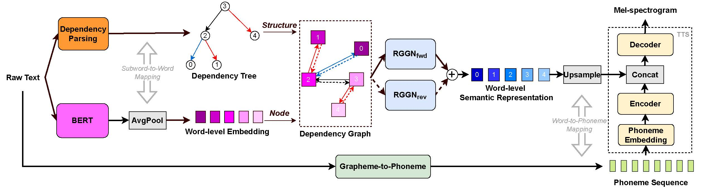
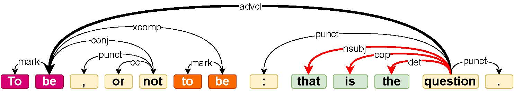
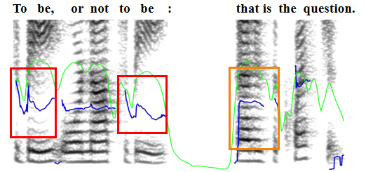
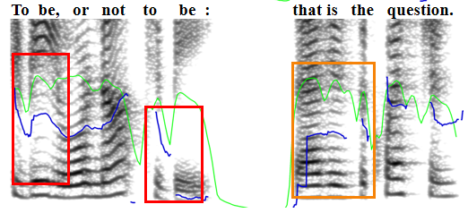
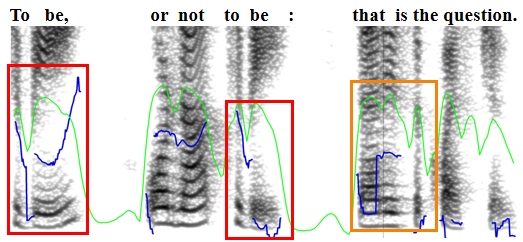

*Yixuan Zhou\*, Changhe Song\*, Jingbei Li, Zhiyong Wu, Yanyao Bian, Dan Su, Helen Meng*

*\* Equal contribution.*

# Abstract

Exploiting rich linguistic information in raw text is crucial for expressive text-to-speech (TTS). As large scale pre-trained text representation develops, bidirectional encoder representations from Transformers (BERT) has been proven to embody semantic information and employed to TTS recently. However, original or simply fine-tuned BERT embeddings still cannot provide sufficient semantic knowledge that expressive TTS models should take into account. In this paper, we propose a word-level semantic representation enhancing method based on dependency structure and pre-trained BERT embedding. The BERT embedding of each word is reprocessed considering its specific dependencies and related words in the sentence, to generate more effective semantic representation for TTS. To better utilize the dependency structure, relational gated graph network (RGGN) is introduced to make semantic information flow and aggregate through the dependency structure. The experimental results show that the proposed method can further improve the naturalness and expressiveness of synthesized speeches on both Mandarin and English datasets.

    
     
    
 Fig.1: The structure of the proposed model. 

# Subjective Evaluation  

To present the generality of the proposed method, we train and evaluate on both DataBaker (Mandarin) and LJSpeech (English) datasets. 
Our proposed method is denoted as **BERT-Dep(RGGN)** and all the models are implemented based on phoneme-input Tacotron 2,  which are described in detail in the paper.
The sentences are selected randomly from the test set and Internet, thus *some samples do not have the corresponding ground-truth speech.* 
Besides, translations of Chinese texts are given in parentheses following.

#### For DataBaker (Mandarin)

| ID | Text | Vanilla | BERT | BERT-Dep(BLSTM) | BERT-Dep(RGGN) | GT |
| :---- | :---- | :---- | :---- | :---- | :---- | :---- |
| DB-000443 | 古语云，不患寡而患不均。(*As the old saying goes, do not suffer from a few but suffer from unevenness.*) | <audio controls><source src="./wavs/DataBaker/Taco2/000443.wav" type="audio/wav">Your browser does not support the audio element.</audio> | <audio controls><source src="./wavs/DataBaker/BERT/000443.wav" type="audio/wav">Your browser does not support the audio element.</audio> | <audio controls><source src="./wavs/DataBaker/DepBLSTM/000443.wav" type="audio/wav">Your browser does not support the audio element.</audio> | <audio controls><source src="./wavs/DataBaker/DepRGGN/000443.wav" type="audio/wav">Your browser does not support the audio element.</audio> | <audio controls><source src="./wavs/DataBaker/GT/000443.wav" type="audio/wav">Your browser does not support the audio element.</audio> | 
| DB-000815 | 香米煮熟后软滑爽口，米饭凉后米粒不发硬。(*The fragrant rice is soft, smooth and refreshing after being cooked, and the rice grains are not hard after the rice is cooled.*) | <audio controls><source src="./wavs/DataBaker/Taco2/000815.wav" type="audio/wav">Your browser does not support the audio element.</audio> | <audio controls><source src="./wavs/DataBaker/BERT/000815.wav" type="audio/wav">Your browser does not support the audio element.</audio> | <audio controls><source src="./wavs/DataBaker/DepBLSTM/000815.wav" type="audio/wav">Your browser does not support the audio element.</audio> | <audio controls><source src="./wavs/DataBaker/DepRGGN/000815.wav" type="audio/wav">Your browser does not support the audio element.</audio> | <audio controls><source src="./wavs/DataBaker/GT/000815.wav" type="audio/wav">Your browser does not support the audio element.</audio> | 
| DB-001097 | 网友留言时称，书记未免也太过于奔放了吧？(*Netizens said in a message that the secretary was too unrestrained, right?*) | <audio controls><source src="./wavs/DataBaker/Taco2/001097.wav" type="audio/wav">Your browser does not support the audio element.</audio> | <audio controls><source src="./wavs/DataBaker/BERT/001097.wav" type="audio/wav">Your browser does not support the audio element.</audio> | <audio controls><source src="./wavs/DataBaker/DepBLSTM/001097.wav" type="audio/wav">Your browser does not support the audio element.</audio> | <audio controls><source src="./wavs/DataBaker/DepRGGN/001097.wav" type="audio/wav">Your browser does not support the audio element.</audio> | <audio controls><source src="./wavs/DataBaker/GT/001097.wav" type="audio/wav">Your browser does not support the audio element.</audio> |    
| DB-001706 | 夏季是筹款淡季，原因是不少捐款者往往在度假。(*Summer is a low season for fundraising, as many donors tend to be on vacation.*) | <audio controls><source src="./wavs/DataBaker/Taco2/001706.wav" type="audio/wav">Your browser does not support the audio element.</audio> | <audio controls><source src="./wavs/DataBaker/BERT/001706.wav" type="audio/wav">Your browser does not support the audio element.</audio> | <audio controls><source src="./wavs/DataBaker/DepBLSTM/001706.wav" type="audio/wav">Your browser does not support the audio element.</audio> | <audio controls><source src="./wavs/DataBaker/DepRGGN/001706.wav" type="audio/wav">Your browser does not support the audio element.</audio> | <audio controls><source src="./wavs/DataBaker/GT/001706.wav" type="audio/wav">Your browser does not support the audio element.</audio> |
| DB-008399 | 那我就给你亮点真本事吧。(*Then let me show you some real strength.*) | <audio controls><source src="./wavs/DataBaker/Taco2/008399.wav" type="audio/wav">Your browser does not support the audio element.</audio> | <audio controls><source src="./wavs/DataBaker/BERT/008399.wav" type="audio/wav">Your browser does not support the audio element.</audio> | <audio controls><source src="./wavs/DataBaker/DepBLSTM/008399.wav" type="audio/wav">Your browser does not support the audio element.</audio> | <audio controls><source src="./wavs/DataBaker/DepRGGN/008399.wav" type="audio/wav">Your browser does not support the audio element.</audio> | <audio controls><source src="./wavs/DataBaker/GT/008399.wav" type="audio/wav">Your browser does not support the audio element.</audio> |
| Internet-1 | 千山鸟飞绝，万径人踪灭，孤舟蓑笠翁，独钓寒江雪。(*From hill to hill no bird in flight, from path to path no man in sight. Alonely fisherman afloat, is fishing snow in lonely boat.*) | <audio controls><source src="./wavs/DataBaker/Taco2/syn_0.wav" type="audio/wav">Your browser does not support the audio element.</audio> | <audio controls><source src="./wavs/DataBaker/BERT/syn_0.wav" type="audio/wav">Your browser does not support the audio element.</audio> | <audio controls><source src="./wavs/DataBaker/DepBLSTM/syn_0.wav" type="audio/wav">Your browser does not support the audio element.</audio> | <audio controls><source src="./wavs/DataBaker/DepRGGN/syn_0.wav" type="audio/wav">Your browser does not support the audio element.</audio> | <audio controls><source src="./wavs/DataBaker/GT/syn_0.wav" type="audio/wav">Your browser does not support the audio element.</audio> |
| Internet-2 | 姑姑也想过过过过儿过过的生活。(*Gugu also had wanted to live the life that Guoer had lived.*) | <audio controls><source src="./wavs/DataBaker/Taco2/syn_1.wav" type="audio/wav">Your browser does not support the audio element.</audio> | <audio controls><source src="./wavs/DataBaker/BERT/syn_1.wav" type="audio/wav">Your browser does not support the audio element.</audio> | <audio controls><source src="./wavs/DataBaker/DepBLSTM/syn_1.wav" type="audio/wav">Your browser does not support the audio element.</audio> | <audio controls><source src="./wavs/DataBaker/DepRGGN/syn_1.wav" type="audio/wav">Your browser does not support the audio element.</audio> | <audio controls><source src="./wavs/DataBaker/GT/syn_1.wav" type="audio/wav">Your browser does not support the audio element.</audio> |
| Internet-3 | 人的一生应当这样度过，当他回首往事时，不会因为碌碌无为，虚度年华而悔恨，也不会因为为人卑劣，生活庸俗而愧疚。(*He must live it so as to feel no torturing regrets for wasted years, never know the burning shame of a mean and petty past.*) | <audio controls><source src="./wavs/DataBaker/Taco2/syn_2.wav" type="audio/wav">Your browser does not support the audio element.</audio> | <audio controls><source src="./wavs/DataBaker/BERT/syn_2.wav" type="audio/wav">Your browser does not support the audio element.</audio> | <audio controls><source src="./wavs/DataBaker/DepBLSTM/syn_2.wav" type="audio/wav">Your browser does not support the audio element.</audio> | <audio controls><source src="./wavs/DataBaker/DepRGGN/syn_2.wav" type="audio/wav">Your browser does not support the audio element.</audio> | <audio controls><source src="./wavs/DataBaker/GT/syn_2.wav" type="audio/wav">Your browser does not support the audio element.</audio> |
  

#### For LJSpeech (English)

*For LJSpeech dataset, the overall sound quality of the synthesized speeches is slightly worse than DataBaker. Please focus more on expressiveness and prosody rather than sound quality, much thanks.*

| ID | Text | Vanilla | BERT | BERT-Dep(BLSTM) | BERT-Dep(RGGN) | GT |
| :---- | :---- | :---- | :---- | :---- | :---- | :---- |
| LJ001-0183 | Therefore, granted well-designed type, due spacing of the lines and words, and proper position of the page on the paper, | <audio controls><source src="./wavs/LJSpeech/Taco2/LJ001-0183.wav" type="audio/wav">Your browser does not support the audio element.</audio> | <audio controls><source src="./wavs/LJSpeech/BERT/LJ001-0183.wav" type="audio/wav">Your browser does not support the audio element.</audio> | <audio controls><source src="./wavs/LJSpeech/DepBLSTM/LJ001-0183.wav" type="audio/wav">Your browser does not support the audio element.</audio> | <audio controls><source src="./wavs/LJSpeech/DepRGGN/LJ001-0183.wav" type="audio/wav">Your browser does not support the audio element.</audio> | <audio controls><source src="./wavs/LJSpeech/GT/LJ001-0183.wav" type="audio/wav">Your browser does not support the audio element.</audio> | 
| LJ003-0282 | Many years were to elapse before these objections should be fairly met and universally overcome. | <audio controls><source src="./wavs/LJSpeech/Taco2/LJ003-0282.wav" type="audio/wav">Your browser does not support the audio element.</audio> | <audio controls><source src="./wavs/LJSpeech/BERT/LJ003-0282.wav" type="audio/wav">Your browser does not support the audio element.</audio> | <audio controls><source src="./wavs/LJSpeech/DepBLSTM/LJ003-0282.wav" type="audio/wav">Your browser does not support the audio element.</audio> | <audio controls><source src="./wavs/LJSpeech/DepRGGN/LJ003-0282.wav" type="audio/wav">Your browser does not support the audio element.</audio> | <audio controls><source src="./wavs/LJSpeech/GT/LJ003-0282.wav" type="audio/wav">Your browser does not support the audio element.</audio> | 
| LJ010-0188 | Oxford expressed little anxiety or concern. | <audio controls><source src="./wavs/LJSpeech/Taco2/LJ010-0188.wav" type="audio/wav">Your browser does not support the audio element.</audio> | <audio controls><source src="./wavs/LJSpeech/BERT/LJ010-0188.wav" type="audio/wav">Your browser does not support the audio element.</audio> | <audio controls><source src="./wavs/LJSpeech/DepBLSTM/LJ010-0188.wav" type="audio/wav">Your browser does not support the audio element.</audio> | <audio controls><source src="./wavs/LJSpeech/DepRGGN/LJ010-0188.wav" type="audio/wav">Your browser does not support the audio element.</audio> | <audio controls><source src="./wavs/LJSpeech/GT/LJ010-0188.wav" type="audio/wav">Your browser does not support the audio element.</audio> | 
| LJ048-0017 | We satisfied ourselves that we had met our requirement, namely to find out whether he had been recruited by soviet intelligence. The case was closed. | <audio controls><source src="./wavs/LJSpeech/Taco2/LJ048-0017.wav" type="audio/wav">Your browser does not support the audio element.</audio> | <audio controls><source src="./wavs/LJSpeech/BERT/LJ048-0017.wav" type="audio/wav">Your browser does not support the audio element.</audio> | <audio controls><source src="./wavs/LJSpeech/DepBLSTM/LJ048-0017.wav" type="audio/wav">Your browser does not support the audio element.</audio> | <audio controls><source src="./wavs/LJSpeech/DepRGGN/LJ048-0017.wav" type="audio/wav">Your browser does not support the audio element.</audio> | <audio controls><source src="./wavs/LJSpeech/GT/LJ048-0017.wav" type="audio/wav">Your browser does not support the audio element.</audio> | 
| Internet-1 | Death is just a part of life, something we are all destined to do. | <audio controls><source src="./wavs/LJSpeech/Taco2/syn_1.wav" type="audio/wav">Your browser does not support the audio element.</audio> | <audio controls><source src="./wavs/LJSpeech/BERT/syn_1.wav" type="audio/wav">Your browser does not support the audio element.</audio> | <audio controls><source src="./wavs/LJSpeech/DepBLSTM/syn_1.wav" type="audio/wav">Your browser does not support the audio element.</audio> | <audio controls><source src="./wavs/LJSpeech/DepRGGN/syn_1.wav" type="audio/wav">Your browser does not support the audio element.</audio> | <audio controls><source src="./wavs/LJSpeech/GT/syn_1.wav" type="audio/wav">Your browser does not support the audio element.</audio> | 

* * *

# Ablation Study
 
Three ablation studies are conducted by removing RGGN_fwd, RGGN_rev, edge labels, respectively in the proposed method.

#### For DataBaker (Mandarin)

| ID | Text | Proposed | - RGGN_fwd | - RGGN_rev | - Edge labels | GT |
| :---- | :---- | :---- | :---- | :---- | :---- | :---- |
| DB-000622 | 副首相克莱格同样为王室游艇建造提议泼冷水。(*Deputy Prime Minister Clegg also poured cold water on the proposal of building a royal yacht.*) | <audio controls><source src="./wavs/DataBaker/DepRGGN/000622.wav" type="audio/wav">Your browser does not support the audio element.</audio> | <audio controls><source src="./wavs/DataBaker/remove_fwd/000622.wav" type="audio/wav">Your browser does not support the audio element.</audio> | <audio controls><source src="./wavs/DataBaker/remove_rev/000622.wav" type="audio/wav">Your browser does not support the audio element.</audio> | <audio controls><source src="./wavs/DataBaker/remove_type/000622.wav" type="audio/wav">Your browser does not support the audio element.</audio> | <audio controls><source src="./wavs/DataBaker/GT/000622.wav" type="audio/wav">Your browser does not support the audio element.</audio> |
| DB-000904 | 张韶涵作势与比萨斜塔拥抱。(*Zhang Shaohan embraced the Leaning Tower of Pisa.*) | <audio controls><source src="./wavs/DataBaker/DepRGGN/000904.wav" type="audio/wav">Your browser does not support the audio element.</audio> | <audio controls><source src="./wavs/DataBaker/remove_fwd/000904.wav" type="audio/wav">Your browser does not support the audio element.</audio> | <audio controls><source src="./wavs/DataBaker/remove_rev/000904.wav" type="audio/wav">Your browser does not support the audio element.</audio> | <audio controls><source src="./wavs/DataBaker/remove_type/000904.wav" type="audio/wav">Your browser does not support the audio element.</audio> | <audio controls><source src="./wavs/DataBaker/GT/000904.wav" type="audio/wav">Your browser does not support the audio element.</audio> |
| DB-001129 | 牛炯正好让学生试写一篇小作文，周琦向他借本古汉语字典。(*Niu Jiong just asked the students to try to write a small composition, and Zhou Qi borrowed an ancient Chinese dictionary from him.*) | <audio controls><source src="./wavs/DataBaker/DepRGGN/001129.wav" type="audio/wav">Your browser does not support the audio element.</audio> | <audio controls><source src="./wavs/DataBaker/remove_fwd/001129.wav" type="audio/wav">Your browser does not support the audio element.</audio> | <audio controls><source src="./wavs/DataBaker/remove_rev/001129.wav" type="audio/wav">Your browser does not support the audio element.</audio> | <audio controls><source src="./wavs/DataBaker/remove_type/001129.wav" type="audio/wav">Your browser does not support the audio element.</audio> | <audio controls><source src="./wavs/DataBaker/GT/001129.wav" type="audio/wav">Your browser does not support the audio element.</audio> |
| Internet-2 | 姑姑也想过过过过儿过过的生活。(*Gugu also had wanted to live the life that Guoer had lived.*) | <audio controls><source src="./wavs/DataBaker/DepRGGN/syn_1.wav" type="audio/wav">Your browser does not support the audio element.</audio> | <audio controls><source src="./wavs/DataBaker/remove_fwd/syn_1.wav" type="audio/wav">Your browser does not support the audio element.</audio> | <audio controls><source src="./wavs/DataBaker/remove_rev/syn_1.wav" type="audio/wav">Your browser does not support the audio element.</audio> | <audio controls><source src="./wavs/DataBaker/remove_type/syn_1.wav" type="audio/wav">Your browser does not support the audio element.</audio> | <audio controls><source src="./wavs/DataBaker/GT/syn_1.wav" type="audio/wav">Your browser does not support the audio element.</audio> |
| Internet-4 | 黑化肥发灰会挥发，灰化肥挥发会发黑。(*The black fertilizer will volatilize when it turns gray, and the gray fertilizer will turn black when it volatilizes.*) | <audio controls><source src="./wavs/DataBaker/DepRGGN/syn_3.wav" type="audio/wav">Your browser does not support the audio element.</audio> | <audio controls><source src="./wavs/DataBaker/remove_fwd/syn_3.wav" type="audio/wav">Your browser does not support the audio element.</audio> | <audio controls><source src="./wavs/DataBaker/remove_rev/syn_3.wav" type="audio/wav">Your browser does not support the audio element.</audio> | <audio controls><source src="./wavs/DataBaker/remove_type/syn_3.wav" type="audio/wav">Your browser does not support the audio element.</audio> | <audio controls><source src="./wavs/DataBaker/GT/syn_3.wav" type="audio/wav">Your browser does not support the audio element.</audio> |

#### For LJSpeech (English)

*For LJSpeech dataset, there exist many bad cases in **- RGGN_fwd**, resulting in a very low CMOS in Table 2 of the paper.*

| ID | Text | Proposed | - RGGN_fwd | - RGGN_rev | - Edge labels | GT |
| :---- | :---- | :---- | :---- | :---- | :---- | :---- |
| LJ003-0282 | Many years were to elapse before these objections should be fairly met and universally overcome. | <audio controls><source src="./wavs/LJSpeech/DepRGGN/LJ003-0282.wav" type="audio/wav">Your browser does not support the audio element.</audio> | <audio controls><source src="./wavs/LJSpeech/remove_fwd/LJ003-0282.wav" type="audio/wav">Your browser does not support the audio element.</audio> | <audio controls><source src="./wavs/LJSpeech/remove_rev/LJ003-0282.wav" type="audio/wav">Your browser does not support the audio element.</audio> | <audio controls><source src="./wavs/LJSpeech/remove_type/LJ003-0282.wav" type="audio/wav">Your browser does not support the audio element.</audio> | <audio controls><source src="./wavs/LJSpeech/GT/LJ003-0282.wav" type="audio/wav">Your browser does not support the audio element.</audio> |  
| LJ010-0188 | Oxford expressed little anxiety or concern. | <audio controls><source src="./wavs/LJSpeech/DepRGGN/LJ010-0188.wav" type="audio/wav">Your browser does not support the audio element.</audio> | <audio controls><source src="./wavs/LJSpeech/remove_fwd/LJ010-0188.wav" type="audio/wav">Your browser does not support the audio element.</audio> | <audio controls><source src="./wavs/LJSpeech/remove_rev/LJ010-0188.wav" type="audio/wav">Your browser does not support the audio element.</audio> | <audio controls><source src="./wavs/LJSpeech/remove_type/LJ010-0188.wav" type="audio/wav">Your browser does not support the audio element.</audio> | <audio controls><source src="./wavs/LJSpeech/GT/LJ010-0188.wav" type="audio/wav">Your browser does not support the audio element.</audio> |     
| LJ048-0017 | We satisfied ourselves that we had met our requirement, namely to find out whether he had been recruited by soviet intelligence. The case was closed. | <audio controls><source src="./wavs/LJSpeech/DepRGGN/LJ048-0017.wav" type="audio/wav">Your browser does not support the audio element.</audio> | <audio controls><source src="./wavs/LJSpeech/remove_fwd/LJ048-0017.wav" type="audio/wav">Your browser does not support the audio element.</audio> | <audio controls><source src="./wavs/LJSpeech/remove_rev/LJ048-0017.wav" type="audio/wav">Your browser does not support the audio element.</audio> | <audio controls><source src="./wavs/LJSpeech/remove_type/LJ048-0017.wav" type="audio/wav">Your browser does not support the audio element.</audio> | <audio controls><source src="./wavs/LJSpeech/GT/LJ048-0017.wav" type="audio/wav">Your browser does not support the audio element.</audio> |    
| Internet-2 | To be, or not to be: that is the question. | <audio controls><source src="./wavs/LJSpeech/DepRGGN/syn_0.wav" type="audio/wav">Your browser does not support the audio element.</audio> | <audio controls><source src="./wavs/LJSpeech/remove_fwd/syn_0.wav" type="audio/wav">Your browser does not support the audio element.</audio> | <audio controls><source src="./wavs/LJSpeech/remove_rev/syn_0.wav" type="audio/wav">Your browser does not support the audio element.</audio> | <audio controls><source src="./wavs/LJSpeech/remove_type/syn_0.wav" type="audio/wav">Your browser does not support the audio element.</audio> | <audio controls><source src="./wavs/LJSpeech/GT/syn_0.wav" type="audio/wav">Your browser does not support the audio element.</audio> |    

* * *

# Case Study

For the sentence **"To be, or not to be: that is the question."**, the speeches & mel-spectrograms generated by different methods are provided, and the dependency tree of this sentence is as follows:

| Method | Synthesized Speech | Mel-Spectrogram |
| :---- | :---- | :---- |
| BERT | <audio controls><source src="./wavs/LJSpeech/BERT/syn_0.wav" type="audio/wav">Your browser does not support the audio element.</audio> | |
| BERT-Dep(BLSTM) | <audio controls><source src="./wavs/LJSpeech/DepBLSTM/syn_0.wav" type="audio/wav">Your browser does not support the audio element.</audio> | |
| BERT-Dep(RGGN) | <audio controls><source src="./wavs/LJSpeech/DepRGGN/syn_0.wav" type="audio/wav">Your browser does not support the audio element.</audio> | |

